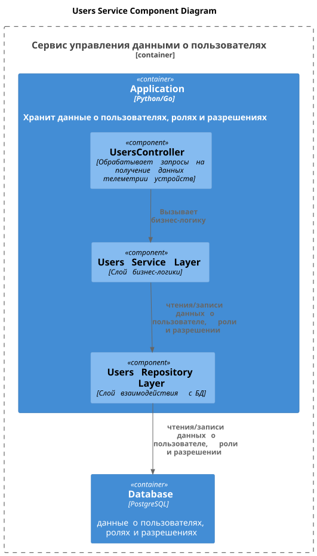
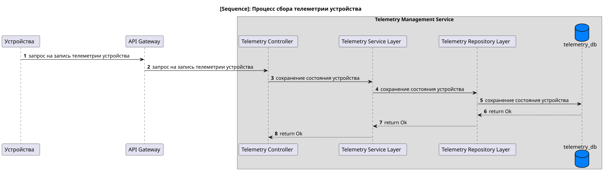
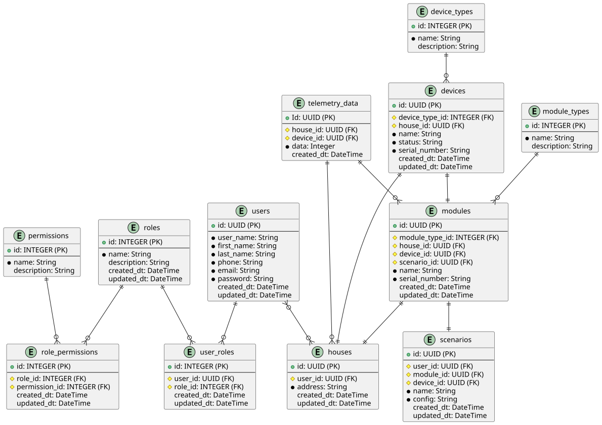

# Задание 1. Анализ и планирование

Проект "Smart Home Monolith" представляет собой монолитное приложение для управления отоплением и мониторинга температуры в умном доме. Пользователи могут удаленно управлять отоплением, устанавливать желаемую температуру и просматривать текущую температуру через веб-интерфейс. Все взаимодействия между сервером и устройствами синхронные, что означает, что сервер напрямую управляет датчиками и получает от них данные по запросу.

## 1.1 Описание функциональности монолитного приложения

### Управление отоплением
- **Включение/выключение отопления**: Пользователи могут удаленно активировать или деактивировать систему отопления.
- **Установка температуры**: Пользователи могут задавать желаемую температуру, которую система будет поддерживать.
- **Автоматическое поддержание температуры**: Система самостоятельно регулирует подачу тепла для достижения заданной температуры.

### Мониторинг температуры
- **Просмотр текущей температуры**: Пользователи могут в реальном времени отслеживать температуру в доме через веб-интерфейс.
- **Получение данных с датчиков**: Система собирает данные о температуре с датчиков, установленных в доме, и передает их на сервер.

## 1.2 Анализ архитектуры монолитного приложения

### Язык программирования: Java
**Плюсы:**
- **Безопасность и надежность**: Java обеспечивает высокий уровень безопасности благодаря строгой типизации и встроенным механизмам управления памятью.
- **Объектно-ориентированный подход**: Позволяет создавать модульные и легко поддерживаемые приложения.
- **Архитектурная независимость**: Код, написанный на Java, может выполняться на любой платформе, поддерживающей JVM.
- **Простота разработки**: Широкий набор библиотек и фреймворков упрощает процесс разработки.

**Минусы:**
- **Производительность**: В сравнении с языками, такими как C++ или Rust, Java может быть менее производительной.
- **Потребление памяти**: Java-приложения часто требуют больше оперативной памяти, что может быть критично для ресурсоемких систем.

### База данных: PostgreSQL
**Плюсы:**
- **Расширяемость**: Поддержка пользовательских типов данных и функций.
- **Масштабируемость**: Возможность горизонтального и вертикального масштабирования.
- **Кросс-платформенность**: Поддержка различных операционных систем.
- **Безопасность**: Встроенные механизмы шифрования и управления доступом.
- **NoSQL-возможности**: Поддержка JSON и других NoSQL-функций.
- **Открытый исходный код**: Бесплатное использование и активное сообщество разработчиков.

**Минусы:**
- **Сложность настройки**: Требует глубоких знаний для оптимальной конфигурации.
- **Потребление ресурсов**: Может быть ресурсоемким, особенно при больших объемах данных.
- **Ограниченные функции**: Некоторые функции, доступные в других СУБД, могут отсутствовать.

### Архитектура: Монолитная
**Плюсы:**
- **Простота разработки**: Все компоненты находятся в одном проекте, что упрощает разработку и тестирование.
- **Экономия средств**: Меньше затрат на инфраструктуру и управление.
- **Удобное тестирование**: Легко проводить end-to-end тестирование.
- **Простая инфраструктура**: Требуется меньше серверов и инструментов для развертывания.

**Минусы:**
- **Сложности с масштабированием**: Монолит сложно масштабировать по частям, что может стать проблемой при росте нагрузки.
- **Сложности с развитием**: Добавление нового функционала может быть затруднено из-за тесной связанности компонентов.
- **Низкая устойчивость к сбоям**: Ошибка в одном компоненте может привести к падению всего приложения.
- **Ограниченное технологическое разнообразие**: Использование новых технологий может быть затруднено.

### Взаимодействие: Синхронное
**Плюсы:**
- **Простота реализации**: Легче разрабатывать и отлаживать синхронные системы.
- **Управление последовательностью**: Легко отслеживать порядок выполнения операций.

**Минусы:**
- **Зависимость от доступности**: Если один из компонентов недоступен, это может привести к сбою всей системы.
- **Узкое место**: Последовательные синхронные вызовы могут стать узким местом в производительности.

### Масштабируемость
Монолитная архитектура ограничивает возможности масштабирования. При увеличении нагрузки необходимо масштабировать все приложение целиком, что может быть неэффективно.

### Развёртывание
Развертывание монолитного приложения требует остановки всего сервиса, что приводит к простоям и неудобствам для пользователей.

## 1.3 Определение доменов и границы контекстов

### Домен: Управление Устройствами
- **Поддомен: Управление отоплением**
  - **Контекст: Включение/выключение устройства**
  - **Контекст: Установка температуры**
- **Поддомен: Автоматическое поддержание температуры**
  - **Контекст: Регулировка подачи тепла**

### Домен: Мониторинг температуры
- **Поддомен: Получение данных с датчиков**
  - **Контекст: Получение данных о температуре**
- **Поддомен: Отображение данных**
  - **Контекст: Отображение текущей температуры в доме**

## 1.4 Проблемы монолитного решения**

С учетом планов компании на расширение функциональности и масштабирование, текущее монолитное решение имеет следующие ограничения:
- **Сложности с масштабированием**: Монолитная архитектура не позволяет гибко масштабировать отдельные компоненты системы.
- **Добавление новой функциональности**: Внесение изменений в монолитное приложение может быть сложным и рискованным процессом.
- **Простои при развертывании**: Обновление системы требует остановки всего приложения, что приводит к простоям.
- **Ограниченный технологический стек**: Использование новых технологий и инструментов затруднено из-за тесной связанности компонентов.

## 1.5 Контекстная диаграмма существующей системы
[Context diagram](diagrams/monolith-diagram.svg)

### Расширение и уточнение

Для улучшения текущей системы и перехода к микросервисной архитектуре необходимо учитывать следующие аспекты:

1. **Разделение на микросервисы**:
   - **Управление отоплением**: Выделить в отдельный сервис, отвечающий за включение/выключение отопления и установку температуры.
   - **Мониторинг температуры**: Создать отдельный сервис для сбора и отображения данных с датчиков.
   - **Автоматическое поддержание температуры**: Этот функционал можно выделить в отдельный сервис, который будет взаимодействовать с сервисом управления отоплением.

2. **Асинхронное взаимодействие**:
   - Внедрение message broker (например, RabbitMQ или Kafka) для асинхронного обмена данными между сервисами. Это позволит уменьшить зависимость от доступности отдельных компонентов и повысить отказоустойчивость системы.

3. **Масштабируемость**:
   - Каждый микросервис можно масштабировать независимо, что позволит эффективно распределять ресурсы и справляться с увеличением нагрузки.

4. **Независимое развертывание**:
   - Микросервисы можно обновлять и развертывать независимо друг от друга, что минимизирует простои и упрощает процесс внедрения новых функций.

5. **Технологическое разнообразие**:
   - Переход на микросервисы позволяет использовать различные технологии и языки программирования для каждого сервиса, что повышает гибкость разработки.

6. **Улучшение отказоустойчивости**:
   - В случае сбоя одного из микросервисов, остальные компоненты системы продолжат работать, что повышает общую надежность системы.

7. **Мониторинг и логирование**:
   - Внедрение централизованного мониторинга и логирования (например, с использованием ELK-стека или Prometheus) для отслеживания состояния системы и оперативного реагирования на проблемы.

Таким образом, переход на микросервисную архитектуру позволит компании более гибко развивать продукт, улучшить масштабируемость и отказоустойчивость, а также снизить риски, связанные с обновлением и поддержкой системы.

# Задание 2. Проектирование микросервисной архитектуры

В этом задании вам нужно предоставить только диаграммы в модели C4. Мы не просим вас отдельно описывать получившиеся микросервисы и то, как вы определили взаимодействия между компонентами To-Be системы. Если вы правильно подготовите диаграммы C4, они и так это покажут.

## 2.1 **Диаграмма контекста (Context)**

[Context diagram](diagrams/microservice_arch/context_diagram.puml)

## 2.2 **Диаграмма контейнеров (Containers)**

[Context diagram](diagrams/microservice_arch/container_diagram.puml)

## 2.3 **Диаграмма компонентов (Components)**

### Device service

[device service](diagrams/microservice_arch/component_diagrams/device_service.puml)

### Scenario service

[device service](diagrams/microservice_arch/component_diagrams/scenario_service.puml)

### Telemetry service

[device service](diagrams/microservice_arch/component_diagrams/telemetry_service.puml)

### User service

[device service](diagrams/microservice_arch/component_diagrams/user_service.puml)

**Диаграмма кода (Code)**

### Telemetry getting

[device service](diagrams/microservice_arch/code_diagrams/telemetry_getting.puml)

# Задание 3. Разработка ER-диаграммы

[device service](diagrams/microservice_arch/ERD.puml)
